# Core Task Management & AI Collaboration Flow

This diagram shows the primary productivity workflow where users create and manage tasks with AI assistance, representing the core value proposition of Vectal as an AI-enhanced task management platform.

## User Personas
- **Primary**: All user types (casual to power users)
- **Secondary**: Professionals, entrepreneurs, project managers

## Key Features Covered
- Task creation and management
- Automatic task breakdown
- AI prioritization and scheduling
- Context-aware assistance
- Goal tracking and analytics

```mermaid
flowchart TD
    %% User Actions (Blue)
    U1[👤 User Creates Task] --> |Input task description| SYS1{System Analyzes Task}
    U2[👤 User Reviews Suggestions] --> |Accept/Modify| SYS2[AI Updates Task List]
    U3[👤 User Adds Context] --> |Notes, docs, deadlines| SYS3[AI Enriches Context]
    U4[👤 User Monitors Progress] --> |Check status| SYS4[Display Progress & Insights]
    U5[👤 User Completes Subtask] --> |Mark done| SYS5[Update Progress & Analytics]

    %% AI Behaviors (Green)
    AI1[🤖 Analyze Task Complexity] --> |Complex task detected| AI2[🤖 Generate Subtask Breakdown]
    AI1 --> |Simple task| AI3[🤖 Add to Task List]
    AI2 --> |Present options| U2
    AI4[🤖 Prioritize Tasks] --> |Context analysis| AI5[🤖 Suggest Optimal Schedule]
    AI6[🤖 Contextual Analysis] --> |Related info found| AI7[🤖 Enhanced Assistance]
    AI8[🤖 Progress Tracking] --> |Calculate completion| AI9[🤖 Generate Insights]

    %% System Processes (Gray)
    SYS1 --> AI1
    SYS2 --> DB1[(Task Database)]
    SYS3 --> AI6
    SYS4 --> AI8
    SYS5 --> AI9

    %% Data Flows
    DB1 --> |Task data| AI4
    AI5 --> |Priority updates| DB1
    AI7 --> |Context-aware suggestions| CHAT1[💬 Task Chat Panel]
    AI9 --> |Analytics data| DASH1[📊 Analytics Dashboard]

    %% UI Components
    TASK1[📋 Task List View] --> |Click task| DETAIL1[📝 Task Detail Panel]
    DETAIL1 --> |Contains| CHAT1
    DETAIL1 --> |Shows| META1[📋 Task Metadata]
    META1 --> |Due date, priority, tags| AI4

    %% State Changes
    STATE1{Task Status} --> |Not Started| STATE2{In Progress}
    STATE2 --> |AI Suggestions Available| STATE3{Awaiting User Review}
    STATE3 --> |User Approves| STATE4{AI Enhanced}
    STATE4 --> |Work Completed| STATE5{Done}

    %% Integration Points
    EXT1[External Calendar] -.-> |Deadline sync| AI4
    EXT2[User Preferences] -.-> |Personalization| AI6
    EXT3[Historical Data] -.-> |Pattern learning| AI9

    %% Styling
    classDef userAction fill:#e1f5fe,stroke:#01579b,stroke-width:2px
    classDef aiAction fill:#e8f5e8,stroke:#2e7d32,stroke-width:2px
    classDef system fill:#f5f5f5,stroke:#616161,stroke-width:2px
    classDef data fill:#fff3e0,stroke:#ef6c00,stroke-width:2px
    classDef ui fill:#f3e5f5,stroke:#7b1fa2,stroke-width:2px
    classDef state fill:#fff8e1,stroke:#f57f17,stroke-width:2px

    class U1,U2,U3,U4,U5 userAction
    class AI1,AI2,AI3,AI4,AI5,AI6,AI7,AI8,AI9 aiAction
    class SYS1,SYS2,SYS3,SYS4,SYS5 system
    class DB1,DASH1 data
    class TASK1,DETAIL1,CHAT1,META1 ui
    class STATE1,STATE2,STATE3,STATE4,STATE5 state
```

## Workflow Details

### 1. Task Creation Flow
1. **User Input**: User creates a new task with description
2. **AI Analysis**: System analyzes task complexity and context
3. **Smart Breakdown**: For complex tasks, AI suggests subtask breakdown
4. **User Review**: User can accept, modify, or reject AI suggestions
5. **Enhancement**: AI adds task to list with enriched metadata

### 2. Contextualization Flow
1. **Context Addition**: User adds notes, documents, or deadlines
2. **AI Processing**: AI analyzes context for relevant information
3. **Enhanced Assistance**: AI provides context-aware suggestions in task chat
4. **Continuous Learning**: System learns from user preferences and patterns

### 3. Prioritization & Scheduling Flow
1. **Context Analysis**: AI analyzes deadlines, dependencies, and user goals
2. **Priority Assignment**: Tasks are automatically prioritized
3. **Schedule Optimization**: AI suggests optimal task ordering
4. **Dynamic Updates**: Priorities adjust as context changes

### 4. Progress Tracking Flow
1. **Status Monitoring**: System tracks task completion progress
2. **Insight Generation**: AI identifies patterns and bottlenecks
3. **Analytics Display**: User sees productivity insights and trends
4. **Goal Tracking**: Long-term project progress visualization

## Key Data Flows

- **Task Data**: User input → AI analysis → Enhanced task metadata → Database storage
- **Context Data**: User context → AI processing → Personalized assistance → Task enhancement
- **Progress Data**: Completion events → Analytics engine → Insights dashboard → User feedback
- **Priority Data**: Context analysis → Priority calculation → Schedule optimization → UI updates

## State Management

### Task States
- **Not Started**: Initial state after creation
- **In Progress**: User or AI actively working on task
- **Awaiting Review**: AI suggestions pending user approval
- **AI Enhanced**: Task enriched with AI-generated content
- **Done**: Task completed successfully

### AI Activity States
- **Analyzing**: Processing task complexity and context
- **Suggesting**: Generating recommendations for user review
- **Enhancing**: Adding value through context-aware assistance
- **Tracking**: Monitoring progress and generating insights

## Integration Points

- **External Calendars**: Sync deadlines and scheduling constraints
- **User Preferences**: Personalization data for AI assistance
- **Historical Data**: Past completion patterns for predictive insights
- **Chat Histories**: Previous conversations for context continuity
- **Document Store**: Attached files for context-aware assistance

## Technical Notes

- **Real-time Updates**: WebSocket connections for live progress updates
- **Context Persistence**: Task context maintained across sessions
- **AI Model Routing**: Automatic selection of appropriate AI models
- **Performance Optimization**: Caching for frequently accessed task data
- **Scalability**: Horizontal scaling for task processing and analytics