# Autonomous Agent Operations (Infinite Thinking)

This diagram shows Vectal's flagship capability: 24/7 autonomous AI agents that work continuously on user-defined goals without constant supervision. This represents the key differentiator from standard AI chatbots.

## User Personas
- **Primary**: Power users, entrepreneurs, project managers
- **Secondary**: Professionals with complex, multi-step projects

## Key Features Covered
- Autonomous goal-oriented AI agents
- Continuous background processing
- 24/7 operation without user intervention
- Think-act cycle orchestration
- User monitoring and control capabilities

```mermaid
flowchart TD
    %% User Actions (Blue)
    U1[👤 User Defines High-Level Goal] --> |"Launch product website next week"| SYS1{Agent Controller}
    U2[👤 User Monitors Progress] --> |Check agent activity| SYS2[Agent Status Dashboard]
    U3[👤 User Intervenes] --> |Pause/Refine goal| SYS3[Agent Control Panel]
    U4[👤 User Reviews Results] --> |Approve/Modify outputs| SYS4[Result Review Interface]

    %% AI Agent Think-Act Cycle (Green)
    AGENT1[🤖 Goal Analysis] --> |Break down into steps| AGENT2[🤖 Planning Phase]
    AGENT2 --> |Create action plan| AGENT3[🤖 Task Queue Generation]
    AGENT3 --> |Execute next step| AGENT4[🤖 Action Execution]
    AGENT4 --> |Evaluate results| AGENT5[🤖 Progress Assessment]
    AGENT5 --> |Continue or adjust| AGENT2
    AGENT5 --> |Goal achieved| AGENT6[🤖 Completion & Report]

    %% Background Processing (Green)
    BG1[🤖 Continuous Processing] --> |24/7 operation| BG2[🤖 Background Scheduler]
    BG2 --> |Queue management| QUEUE1[(Task Queue)]
    QUEUE1 --> |Next task| AGENT4
    BG3[🤖 Context Maintenance] --> |Long-term memory| CONTEXT1[(Agent Context)]
    CONTEXT1 --> |Historical awareness| AGENT1

    %% System Infrastructure (Gray)
    SYS1 --> AGENT1
    SYS2 --> MONITOR1[📊 Activity Monitor]
    SYS3 --> CONTROL1[⚙️ Agent Controller]
    SYS4 --> OUTPUT1[📄 Output Manager]

    %% Orchestration Engine (Gray)
    ORCH1[⚙️ Workflow Orchestrator] --> |Possibly n8n| ORCH2[🔄 Think-Act Loop Manager]
    ORCH2 --> |Iteration control| AGENT2
    ORCH3[⏱️ Scheduler] --> |Time-based triggers| BG2
    ORCH4[🎯 Goal Tracker] --> |Progress monitoring| AGENT5

    %% Data Flows and Storage
    DB1[(Goals Database)] --> |Goal definition| AGENT1
    DB2[(Progress Database)] --> |Historical data| AGENT5
    DB3[(Output Database)] --> |Generated content| OUTPUT1
    LOGS1[(Agent Logs)] --> |Activity tracking| MONITOR1

    %% External Tool Integration
    TOOL1[🔍 Ultra Search] -.-> |Information gathering| AGENT4
    TOOL2[📄 Document Processor] -.-> |Content analysis| AGENT4
    TOOL3[💬 Chat Interface] -.-> |User communication| AGENT4
    TOOL4[🌐 Web APIs] -.-> |External actions| AGENT4

    %% Real-time Status Updates
    STATUS1{Agent Status} --> |Running| STATUS2[🟢 Active Processing]
    STATUS1 --> |Paused| STATUS3[🟡 User Intervention]
    STATUS1 --> |Completed| STATUS4[🔵 Goal Achieved]
    STATUS1 --> |Error| STATUS5[🔴 Issue Resolution]

    %% Progress Indicators
    PROG1[📈 Goal Progress] --> |"60% complete"| U2
    PROG2[🔄 Current Activity] --> |"Researching domain options..."| U2
    PROG3[📝 Recent Outputs] --> |Generated content| U4
    PROG4[⏱️ Time Active] --> |"Working for 2 hours"| U2

    %% User Control Mechanisms
    CTRL1[⏸️ Pause Agent] --> SYS3
    CTRL2[▶️ Resume Agent] --> SYS3
    CTRL3[🛑 Stop Agent] --> SYS3
    CTRL4[🎯 Refine Goal] --> SYS1

    %% AI Model Integration
    MODEL1[🧠 Long-Context Models] --> |GPT-4.5, Claude 3.7| AGENT1
    MODEL2[⚡ Fast Models] --> |Quick decisions| AGENT4
    MODEL3[🎯 Specialized Models] --> |Domain tasks| AGENT4

    %% Styling
    classDef userAction fill:#e1f5fe,stroke:#01579b,stroke-width:2px
    classDef aiAgent fill:#e8f5e8,stroke:#2e7d32,stroke-width:2px
    classDef background fill:#e8f5e8,stroke:#2e7d32,stroke-width:1px,stroke-dasharray: 5 5
    classDef system fill:#f5f5f5,stroke:#616161,stroke-width:2px
    classDef orchestration fill:#fff3e0,stroke:#ef6c00,stroke-width:2px
    classDef data fill:#fff8e1,stroke:#f57f17,stroke-width:2px
    classDef status fill:#f3e5f5,stroke:#7b1fa2,stroke-width:2px
    classDef tools fill:#e0f2f1,stroke:#00695c,stroke-width:1px,stroke-dasharray: 3 3

    class U1,U2,U3,U4 userAction
    class AGENT1,AGENT2,AGENT3,AGENT4,AGENT5,AGENT6 aiAgent
    class BG1,BG2,BG3 background
    class SYS1,SYS2,SYS3,SYS4,MONITOR1,CONTROL1,OUTPUT1 system
    class ORCH1,ORCH2,ORCH3,ORCH4 orchestration
    class DB1,DB2,DB3,LOGS1,QUEUE1,CONTEXT1 data
    class STATUS1,STATUS2,STATUS3,STATUS4,STATUS5,PROG1,PROG2,PROG3,PROG4 status
    class TOOL1,TOOL2,TOOL3,TOOL4,MODEL1,MODEL2,MODEL3 tools
```

## Workflow Details

### 1. Goal Definition & Agent Activation
1. **User Input**: User provides high-level goal description
2. **Goal Analysis**: AI agent analyzes complexity and scope
3. **Agent Activation**: Infinite Thinking mode initiated
4. **Initial Planning**: Agent creates preliminary action plan

### 2. Autonomous Think-Act Cycle
1. **Planning Phase**: Agent breaks down current objective into actionable steps
2. **Task Queue Generation**: Specific tasks added to execution queue
3. **Action Execution**: Agent performs next task using available tools
4. **Progress Assessment**: Agent evaluates results and determines next steps
5. **Iteration**: Cycle repeats until goal is achieved or user intervenes

### 3. Continuous Background Processing
1. **24/7 Operation**: Agent works continuously without user supervision
2. **Background Scheduler**: Manages task timing and resource allocation
3. **Context Maintenance**: Preserves long-term memory across sessions
4. **Queue Management**: Prioritizes and schedules autonomous tasks

### 4. User Monitoring & Control
1. **Progress Monitoring**: Real-time view of agent activity and progress
2. **Status Updates**: Continuous feedback on current agent actions
3. **Output Review**: User can review and approve agent-generated content
4. **Intervention Controls**: Pause, resume, stop, or refine agent operations

## Key Data Flows

- **Goal Data**: User goal → Agent analysis → Task breakdown → Execution plan
- **Progress Data**: Agent actions → Progress tracking → Status updates → User dashboard
- **Context Data**: Historical actions → Long-term memory → Informed decision making
- **Output Data**: Agent results → Content storage → User review → Approval workflow

## State Management

### Agent States
- **Initializing**: Processing user goal and creating initial plan
- **Active**: Continuously executing tasks in think-act cycle
- **Paused**: Temporarily stopped by user intervention
- **Waiting**: Awaiting user approval or external resource
- **Completed**: Goal achieved successfully
- **Error**: Issue encountered requiring resolution

### Progress States
- **Goal Progress**: Overall completion percentage
- **Current Activity**: Specific task being performed
- **Queue Status**: Number of pending tasks
- **Resource Usage**: Computational resources consumed

## Technical Architecture

### Orchestration Engine
- **Workflow Manager**: Coordinates think-act cycle iterations
- **Task Scheduler**: Manages timing and resource allocation
- **Goal Tracker**: Monitors progress toward objectives
- **Error Handler**: Manages exceptions and recovery

### Background Processing
- **Persistent Workers**: Long-running processes for continuous operation
- **Task Queue**: Redis/Celery-based job management
- **Context Storage**: Maintains agent memory across sessions
- **Resource Management**: Prevents resource exhaustion

### AI Model Integration
- **Long-Context Models**: GPT-4.5, Claude 3.7 for complex reasoning
- **Fast Models**: Quick decision-making for routine tasks
- **Specialized Models**: Domain-specific AI for particular tasks
- **Model Routing**: Automatic selection based on task requirements

## Integration Points

### Internal Tool Access
- **Ultra Search**: Web research capabilities
- **Document Processor**: PDF analysis and content extraction
- **Chat Interface**: User communication when needed
- **Task Manager**: Integration with core task management

### External APIs
- **Web Services**: For information gathering and external actions
- **Cloud Storage**: For persistent data and file management
- **Notification Services**: For user alerts and status updates
- **Authentication**: For secure external service access

## Usage Quotas & Limitations

### Free Tier
- Limited to 1 simultaneous Infinite Thinking agent
- Restricted number of think-act cycles per day
- Basic model access only

### Pro Tier
- 20× more Infinite Thinking usage
- Multiple concurrent agents
- Access to advanced models (GPT-4.5, Claude Opus)
- Priority processing

## Key Differentiators

1. **True Autonomy**: Unlike reactive chatbots, agents work independently
2. **Continuous Operation**: 24/7 processing without user supervision
3. **Goal-Oriented**: Focused on achieving specific objectives
4. **Context Awareness**: Maintains long-term memory and goal understanding
5. **Tool Integration**: Can use various tools and services autonomously
6. **User Control**: Full transparency and control over agent operations

## Technical Implementation Notes

- **Workflow Engine**: Likely uses n8n or similar automation platform
- **Long Context**: Leverages Claude's ~100k token context window
- **Persistence**: Agent state preserved across application restarts
- **Scalability**: Horizontal scaling for multiple concurrent agents
- **Monitoring**: Comprehensive logging and performance tracking