# Document Integration & Knowledge Processing

This diagram shows how Vectal processes and integrates user-provided documents (PDFs) to create a dynamic, queryable knowledge base that enhances AI assistance with context-aware responses.

## User Personas
- **Primary**: Knowledge workers, researchers, students, professionals
- **Secondary**: Content creators, analysts, legal professionals

## Key Features Covered
- PDF upload and text extraction
- Large-context document processing
- Vector embedding and semantic search
- Context-aware Q&A capabilities
- Document-driven task assistance

```mermaid
flowchart TD
    %% User Actions (Blue)
    U1[👤 User Uploads PDF] --> |Select file| SYS1{File Upload Handler}
    U2[👤 User Asks Document Question] --> |"What are key findings?"| SYS2{Query Processor}
    U3[👤 User Attaches Doc to Task] --> |Link document| SYS3{Task-Document Linker}
    U4[👤 User Reviews Analysis] --> |Read AI summary| SYS4{Response Display}

    %% Document Processing Pipeline (Green)
    PROC1[📄 File Type Detection] --> |PDF identified| PROC2[🔍 Text Extraction]
    PROC2 --> |OCR if scanned| PROC3[📝 Text Cleaning]
    PROC2 --> |Direct text if digital| PROC3
    PROC3 --> |Clean text output| PROC4[✂️ Text Chunking]
    PROC4 --> |Semantic chunks| PROC5{Processing Route Decision}

    %% Hybrid Processing Approach (Green)
    PROC5 --> |Large doc >100k tokens| ROUTE1[🔄 Vector Embedding Route]
    PROC5 --> |Medium doc <100k tokens| ROUTE2[🧠 Direct Context Route]
    
    %% Vector Embedding Route
    ROUTE1 --> VEC1[🔢 Generate Embeddings]
    VEC1 --> |Vector representations| VEC2[(Vector Database)]
    VEC2 --> |Semantic search| VEC3[🎯 Relevant Chunk Retrieval]
    VEC3 --> |Context chunks| AI1[🤖 AI Analysis]

    %% Direct Context Route
    ROUTE2 --> |Full document| AI2[🤖 Large-Context AI Model]
    AI2 --> |Claude 3.7 Sonnet| AI1

    %% AI Processing (Green)
    AI1 --> |Document understanding| AI3[🤖 Context-Aware Response]
    AI3 --> |Tailored answer| SYS4

    %% Storage and Indexing (Orange)
    DB1[(Document Store)] --> |File metadata| PROC1
    DB2[(Processed Text)] --> |Clean text| PROC4
    DB3[(Vector Embeddings)] --> |Semantic index| VEC3
    DB4[(Document Metadata)] --> |Index, tags, links| SYS3

    %% Integration with Task System (Purple)
    TASK1[📋 Task Context] -.-> |Related docs| AI1
    TASK2[💬 Task Chat] -.-> |Document Q&A| SYS2
    TASK3[📊 Task Enhancement] -.-> |Doc insights| AI3

    %% Large Context Handling (Green)
    CLAUDE1[🧠 Claude 3.7 Sonnet] --> |~100k tokens| LC1[📚 Large Context Processing]
    CLAUDE2[🧠 Claude Opus] --> |~200k tokens| LC2[📖 Extended Context Processing]
    LC1 --> |Comprehensive analysis| AI1
    LC2 --> |Deep document understanding| AI1

    %% System Components (Gray)
    SYS1 --> PROC1
    SYS2 --> QUERY1[🔍 Query Analysis]
    SYS3 --> LINK1[🔗 Document Linking]
    SYS4 --> RESP1[📄 Response Formatter]

    %% Query Processing Flow
    QUERY1 --> |Semantic search query| VEC2
    QUERY1 --> |Direct question| AI2
    QUERY1 --> |Context needed| TASK1

    %% Technical Infrastructure (Gray)
    INFRA1[⚙️ OCR Engine] -.-> |Tesseract/Cloud OCR| PROC2
    INFRA2[🗄️ Vector DB Service] -.-> |Pinecone/Weaviate| VEC2
    INFRA3[☁️ Cloud Storage] -.-> |S3/Similar| DB1
    INFRA4[🔐 Security Layer] -.-> |Encryption| DB1

    %% Real-time Status Updates
    STATUS1{Processing Status} --> |Uploading| STATUS2[📤 Upload Progress]
    STATUS1 --> |Processing| STATUS3[⚙️ Text Extraction]
    STATUS1 --> |Indexing| STATUS4[🔢 Embedding Generation]
    STATUS1 --> |Ready| STATUS5[✅ Available for Q&A]

    %% Use Cases (Purple)
    USE1[📊 Document Summarization] --> SYS2
    USE2[❓ Specific Q&A] --> SYS2
    USE3[🔍 Information Extraction] --> SYS2
    USE4[📝 Content Generation] --> AI3
    USE5[🎯 Task Context Enhancement] --> SYS3

    %% Error Handling (Red)
    ERROR1{Error Detection} --> |Corrupt file| ERROR2[❌ Upload Failed]
    ERROR1 --> |OCR failed| ERROR3[❌ Text Extraction Failed]
    ERROR1 --> |Vector generation failed| ERROR4[❌ Indexing Failed]
    ERROR2 --> |Retry mechanism| SYS1
    ERROR3 --> |Alternative processing| PROC2
    ERROR4 --> |Fallback to direct context| ROUTE2

    %% Performance Optimization
    CACHE1[(Response Cache)] -.-> |Cached answers| AI3
    BATCH1[📦 Batch Processing] -.-> |Multiple docs| PROC1
    STREAM1[🌊 Streaming Responses] -.-> |Real-time answers| SYS4

    %% Styling
    classDef userAction fill:#e1f5fe,stroke:#01579b,stroke-width:2px
    classDef docProcessing fill:#e8f5e8,stroke:#2e7d32,stroke-width:2px
    classDef aiProcessing fill:#e8f5e8,stroke:#2e7d32,stroke-width:2px
    classDef system fill:#f5f5f5,stroke:#616161,stroke-width:2px
    classDef storage fill:#fff8e1,stroke:#f57f17,stroke-width:2px
    classDef integration fill:#f3e5f5,stroke:#7b1fa2,stroke-width:2px
    classDef infrastructure fill:#e0f2f1,stroke:#00695c,stroke-width:1px,stroke-dasharray: 3 3
    classDef status fill:#fff3e0,stroke:#ef6c00,stroke-width:2px
    classDef error fill:#ffebee,stroke:#c62828,stroke-width:2px

    class U1,U2,U3,U4 userAction
    class PROC1,PROC2,PROC3,PROC4,PROC5,ROUTE1,ROUTE2,VEC1,VEC3 docProcessing
    class AI1,AI2,AI3,CLAUDE1,CLAUDE2,LC1,LC2 aiProcessing
    class SYS1,SYS2,SYS3,SYS4,QUERY1,LINK1,RESP1 system
    class DB1,DB2,DB3,DB4,VEC2,CACHE1 storage
    class TASK1,TASK2,TASK3,USE1,USE2,USE3,USE4,USE5 integration
    class INFRA1,INFRA2,INFRA3,INFRA4,BATCH1,STREAM1 infrastructure
    class STATUS1,STATUS2,STATUS3,STATUS4,STATUS5 status
    class ERROR1,ERROR2,ERROR3,ERROR4 error
```

## Workflow Details

### 1. Document Upload & Processing
1. **File Upload**: User selects and uploads PDF document
2. **File Detection**: System identifies document type and characteristics
3. **Text Extraction**: OCR for scanned PDFs, direct extraction for digital PDFs
4. **Text Cleaning**: Remove artifacts, normalize formatting, prepare for processing
5. **Processing Route Decision**: Choose vector embedding or direct context approach

### 2. Hybrid Processing Architecture
**Vector Embedding Route (Large Documents)**:
1. **Text Chunking**: Split document into semantic chunks
2. **Embedding Generation**: Create vector representations of chunks
3. **Vector Storage**: Store embeddings in specialized database
4. **Semantic Search**: Retrieve relevant chunks based on query similarity

**Direct Context Route (Medium Documents)**:
1. **Full Document Load**: Feed entire document to large-context model
2. **Claude Integration**: Use Claude 3.7 Sonnet or Opus for processing
3. **Comprehensive Analysis**: Analyze entire document in single operation

### 3. Document Query & Analysis
1. **Query Processing**: Analyze user question for intent and context
2. **Information Retrieval**: Use appropriate method (vector search or direct context)
3. **AI Analysis**: Generate context-aware response using retrieved information
4. **Response Formatting**: Present answer with document references and citations

### 4. Task Integration
1. **Document Linking**: Associate documents with specific tasks
2. **Context Enhancement**: Use document content to improve task assistance
3. **Automated Analysis**: Suggest task breakdowns based on document content
4. **Progress Tracking**: Update task progress based on document insights

## Key Data Flows

- **Upload Flow**: PDF file → Text extraction → Processing route → Storage/Indexing
- **Query Flow**: User question → Query analysis → Information retrieval → AI response
- **Integration Flow**: Document content → Task context → Enhanced AI assistance
- **Context Flow**: Document knowledge → AI model context → Personalized responses

## Technical Architecture

### Document Processing Engine
- **OCR Integration**: Tesseract or cloud-based OCR services
- **Text Extraction**: PDF parsing libraries for digital documents
- **Cleaning Pipeline**: Text normalization and artifact removal
- **Chunking Strategy**: Semantic segmentation for optimal processing

### Vector Database Integration
- **Embedding Models**: Specialized models for document embedding generation
- **Vector Storage**: Pinecone, Weaviate, or similar vector database
- **Similarity Search**: Cosine similarity for relevant chunk retrieval
- **Index Management**: Efficient indexing and search optimization

### Large-Context Model Integration
- **Claude 3.7 Sonnet**: ~100k token context window
- **Claude Opus**: ~200k token context window for extended documents
- **Context Management**: Efficient prompt construction and token management
- **Response Streaming**: Real-time response generation for large documents

## Storage Architecture

### Document Storage
- **File Storage**: Secure cloud storage (S3-compatible)
- **Metadata Database**: Document information, processing status, links
- **Text Storage**: Processed and cleaned text content
- **Vector Storage**: Embeddings and similarity indexes

### Security & Privacy
- **Encryption**: Data at rest and in transit encryption
- **User Isolation**: Complete segregation of user document data
- **Access Control**: Role-based access to document content
- **Retention Policy**: User-controlled document deletion and retention

## Integration Points

### Task Management System
- **Document-Task Linking**: Associate documents with specific tasks
- **Context-Aware Assistance**: Use document content in task chat
- **Automated Insights**: Generate task suggestions from document analysis
- **Progress Enhancement**: Track task completion using document context

### AI Chat Interface
- **Document Q&A**: Ask questions about uploaded documents
- **Citation Handling**: Provide source references in responses
- **Multi-Document Queries**: Answer questions across multiple documents
- **Context Preservation**: Maintain document context across chat sessions

### External Services
- **Cloud OCR**: Enhanced text extraction for complex documents
- **Translation Services**: Multi-language document processing
- **Content APIs**: Integration with external knowledge sources
- **Backup Services**: Redundant storage and disaster recovery

## Performance Considerations

### Optimization Strategies
- **Caching**: Cache frequently accessed document content and responses
- **Batch Processing**: Handle multiple document uploads efficiently
- **Streaming**: Provide real-time responses for large document queries
- **Compression**: Optimize storage and transfer of document data

### Scalability Features
- **Horizontal Scaling**: Distribute processing across multiple servers
- **Queue Management**: Handle document processing in background queues
- **Load Balancing**: Distribute document queries across available resources
- **Auto-scaling**: Dynamically adjust resources based on processing demand

## Use Cases & Applications

### Research & Analysis
- **Academic Papers**: Extract key findings and methodology
- **Legal Documents**: Analyze contracts and compliance requirements
- **Technical Manuals**: Quick reference and troubleshooting assistance
- **Reports**: Summarize insights and recommendations

### Content Creation
- **Reference Material**: Use documents as source material for new content
- **Fact Checking**: Verify information against uploaded documents
- **Citation Generation**: Automatically cite relevant document sections
- **Knowledge Base**: Build personal or organizational knowledge repositories

### Business Applications
- **Document Review**: Automated analysis of business documents
- **Compliance Checking**: Verify adherence to policies and regulations
- **Knowledge Management**: Centralized access to organizational knowledge
- **Decision Support**: Data-driven insights from document analysis