# System Architecture & Multi-Model Orchestration

This diagram shows the comprehensive technical infrastructure that supports all Vectal workflows, including the multi-model AI orchestration, data architecture, security measures, and scalability features that enable Vectal's AI-powered productivity platform.

## Scope
- **Technical Infrastructure**: Complete system architecture overview
- **AI Model Management**: Multi-model orchestration and routing
- **Data Architecture**: Storage, security, and performance optimization
- **Integration Framework**: External services and API management

## Key Components Covered
- Frontend and backend architecture
- AI model routing and orchestration
- Data storage and security layers
- External service integrations
- Scalability and monitoring systems

```mermaid
flowchart TD
    %% Client Layer (Blue)
    CLIENT1[💻 Web Application] --> |HTTPS/WSS| LB1[⚖️ Load Balancer]
    CLIENT2[📱 Mobile Browser] --> |Responsive| LB1
    CLIENT3[🔌 API Clients] --> |REST/GraphQL| LB1

    %% Load Balancing & API Gateway (Gray)
    LB1 --> |Distribution| GW1[🚪 API Gateway]
    GW1 --> |Authentication| AUTH1[🔐 Auth Service]
    GW1 --> |Rate Limiting| RATE1[⏱️ Rate Limiter]
    GW1 --> |Request Routing| APP1[🖥️ App Server 1]
    GW1 --> APP2[🖥️ App Server 2]
    GW1 --> APP3[🖥️ App Server N]

    %% Application Server Layer (Gray)
    APP1 --> |Core Logic| CORE1[⚙️ Core Application]
    CORE1 --> |User Management| USER1[👤 User Service]
    CORE1 --> |Task Management| TASK1[📋 Task Service]
    CORE1 --> |Chat Management| CHAT1[💬 Chat Service]
    CORE1 --> |File Management| FILE1[📄 File Service]

    %% AI Orchestration Hub (Green)
    CORE1 --> |AI Requests| ORCH1[🧠 AI Orchestration Service]
    ORCH1 --> |Model Selection| ROUTER1[🎯 Model Router]
    ORCH1 --> |Prompt Construction| PROMPT1[📝 Prompt Builder]
    ORCH1 --> |Context Management| CTX1[🧩 Context Manager]
    ORCH1 --> |Response Processing| RESP1[📊 Response Processor]

    %% Multi-Model Integration (Green)
    ROUTER1 --> |Pro Users| MODEL1[🤖 GPT-4.5]
    ROUTER1 --> |Reasoning Tasks| MODEL2[🧠 Claude 3.7 Sonnet]
    ROUTER1 --> |Large Context| MODEL3[📚 Claude Opus]
    ROUTER1 --> |Experimental| MODEL4[🔬 DeepSeek R1]
    ROUTER1 --> |Fast Queries| MODEL5[⚡ Claude Instant]

    %% Model Proxy Layer (Green)
    PROXY1[🔄 AI Model Proxy] --> |OpenAI API| MODEL1
    PROXY1 --> |Anthropic API| MODEL2
    PROXY1 --> |Anthropic API| MODEL3
    PROXY1 --> |DeepSeek API| MODEL4
    PROXY1 --> |Anthropic API| MODEL5
    ROUTER1 --> PROXY1

    %% Autonomous Agent Controller (Green)
    ORCH1 --> |Long-running Tasks| AGENT_CTRL[🤖 Agent Controller]
    AGENT_CTRL --> |Task Queue| QUEUE1[(Redis Queue)]
    AGENT_CTRL --> |Worker Processes| WORKER1[⚙️ Agent Worker 1]
    AGENT_CTRL --> WORKER2[⚙️ Agent Worker 2]
    AGENT_CTRL --> WORKER3[⚙️ Agent Worker N]
    WORKER1 --> |Agent Actions| PROXY1

    %% Workflow Orchestration (Orange)
    AGENT_CTRL --> |Workflow Engine| WF1[🔄 n8n Orchestrator]
    WF1 --> |Think-Act Cycle| WF2[🧠 Agent Logic]
    WF2 --> |External Tools| TOOLS1[🛠️ Tool Integration]
    TOOLS1 --> |Ultra Search| EXT1[🔍 External Search APIs]
    TOOLS1 --> |File Processing| FILE_PROC[📄 Document Processor]

    %% Data Storage Layer (Orange)
    CORE1 --> |Structured Data| DB1[(🗄️ PostgreSQL)]
    CORE1 --> |User Sessions| CACHE1[(⚡ Redis Cache)]
    CORE1 --> |File Storage| STORAGE1[☁️ Cloud Storage S3]
    CORE1 --> |Vector Data| VECTOR1[(🔢 Vector Database)]

    %% Database Cluster (Orange)
    DB1 --> |Primary| DB_P[🗄️ Primary DB]
    DB1 --> |Read Replicas| DB_R1[📖 Read Replica 1]
    DB1 --> |Read Replicas| DB_R2[📖 Read Replica 2]
    DB1 --> |Backup| DB_BACKUP[💾 Backup Storage]

    %% Document Processing Pipeline (Orange)
    FILE1 --> |PDF Upload| FILE_PROC
    FILE_PROC --> |OCR/Extraction| OCR1[🔍 OCR Engine]
    FILE_PROC --> |Text Processing| TXT_PROC[📝 Text Processor]
    TXT_PROC --> |Embedding Generation| EMB1[🔢 Embedding Service]
    EMB1 --> |Vector Storage| VECTOR1

    %% Vector Database Integration (Orange)
    VECTOR1 --> |Pinecone| VDB1[📊 Pinecone]
    VECTOR1 --> |Weaviate| VDB2[🧠 Weaviate]
    VECTOR1 --> |ChromaDB| VDB3[🔍 ChromaDB]

    %% External Service Integration (Purple)
    CORE1 --> |External APIs| EXT_GATEWAY[🌐 External Gateway]
    EXT_GATEWAY --> |Google OAuth| EXT_AUTH[🔐 Google OAuth]
    EXT_GATEWAY --> |Search APIs| EXT1
    EXT_GATEWAY --> |Perplexity| EXT2[🔍 Perplexity API]
    EXT_GATEWAY --> |Notifications| EXT3[📧 Email Service]
    EXT_GATEWAY --> |Analytics| EXT4[📊 Analytics Service]

    %% Security Layer (Red)
    SEC1[🛡️ Security Layer] --> |Encryption| ENC1[🔒 Data Encryption]
    SEC1 --> |Access Control| ACL1[🚪 Access Control]
    SEC1 --> |Audit Logging| AUDIT1[📋 Audit Logger]
    SEC1 --> |GDPR Compliance| GDPR1[⚖️ Privacy Controls]
    
    %% Security Implementation
    ENC1 --> |At Rest| DB1
    ENC1 --> |In Transit| LB1
    ACL1 --> |User Isolation| USER1
    AUDIT1 --> |Activity Logs| LOGS1[(📋 Log Storage)]

    %% Monitoring & Observability (Purple)
    MONITOR1[📊 Monitoring Hub] --> |Application Metrics| APP_METRICS[📈 App Metrics]
    MONITOR1 --> |AI Performance| AI_METRICS[🧠 AI Metrics]
    MONITOR1 --> |Infrastructure| INFRA_METRICS[🏗️ Infra Metrics]
    MONITOR1 --> |Error Tracking| ERROR_TRACK[❌ Error Tracking]

    %% Metrics Collection
    APP_METRICS --> |Performance| PERF1[⚡ Performance Data]
    AI_METRICS --> |Model Usage| USAGE1[📊 Usage Analytics]
    INFRA_METRICS --> |Resource Utilization| RES1[💾 Resource Data]
    ERROR_TRACK --> |Error Analysis| ERR1[🔍 Error Analysis]

    %% Auto-Scaling & Resource Management (Purple)
    SCALE1[📈 Auto Scaler] --> |Horizontal Scaling| APP_SCALE[➡️ App Server Scaling]
    SCALE1 --> |Database Scaling| DB_SCALE[📊 DB Scaling]
    SCALE1 --> |Queue Scaling| QUEUE_SCALE[⚙️ Worker Scaling]
    APP_SCALE --> |Add/Remove| APP2
    DB_SCALE --> |Read Replicas| DB_R2
    QUEUE_SCALE --> |Workers| WORKER2

    %% Content Delivery (Blue)
    CDN1[🌐 CDN] --> |Static Assets| CLIENT1
    CDN1 --> |Global Distribution| CACHE2[⚡ Edge Cache]
    STORAGE1 --> |Asset Delivery| CDN1

    %% Backup & Disaster Recovery (Orange)
    BACKUP1[💾 Backup System] --> |Database Backup| DB_BACKUP
    BACKUP1 --> |File Backup| STORAGE_BACKUP[☁️ Backup Storage]
    BACKUP1 --> |Configuration| CONFIG_BACKUP[⚙️ Config Backup]
    
    %% Data Pipeline (Orange)
    PIPELINE1[🔄 Data Pipeline] --> |ETL Processes| ETL1[📊 Data Transformation]
    ETL1 --> |Analytics DB| ANALYTICS_DB[(📈 Analytics Database)]
    ETL1 --> |ML Training| ML_DATA[🤖 ML Dataset]

    %% Real-time Communication (Blue)
    REALTIME1[⚡ Real-time Engine] --> |WebSockets| WS1[🔌 WebSocket Server]
    WS1 --> |Live Updates| CLIENT1
    WS1 --> |Agent Progress| AGENT_CTRL
    WS1 --> |Chat Streaming| CHAT1

    %% Performance Optimization (Gray)
    PERF_OPT1[🚀 Performance Layer] --> |Caching Strategy| CACHE_STRAT[⚡ Multi-Level Cache]
    CACHE_STRAT --> |Application Cache| CACHE1
    CACHE_STRAT --> |CDN Cache| CDN1
    CACHE_STRAT --> |Database Cache| DB_CACHE[📊 Query Cache]

    %% Styling
    classDef client fill:#e1f5fe,stroke:#01579b,stroke-width:2px
    classDef system fill:#f5f5f5,stroke:#616161,stroke-width:2px
    classDef aiModel fill:#e8f5e8,stroke:#2e7d32,stroke-width:2px
    classDef data fill:#fff8e1,stroke:#f57f17,stroke-width:2px
    classDef external fill:#f3e5f5,stroke:#7b1fa2,stroke-width:2px
    classDef security fill:#ffebee,stroke:#c62828,stroke-width:2px
    classDef monitoring fill:#e8eaf6,stroke:#3f51b5,stroke-width:2px
    classDef orchestration fill:#fff3e0,stroke:#ef6c00,stroke-width:2px

    class CLIENT1,CLIENT2,CLIENT3,CDN1,CACHE2,REALTIME1,WS1 client
    class LB1,GW1,AUTH1,RATE1,APP1,APP2,APP3,CORE1,USER1,TASK1,CHAT1,FILE1 system
    class ORCH1,ROUTER1,PROMPT1,CTX1,RESP1,MODEL1,MODEL2,MODEL3,MODEL4,MODEL5,PROXY1,AGENT_CTRL,WORKER1,WORKER2,WORKER3 aiModel
    class DB1,DB_P,DB_R1,DB_R2,DB_BACKUP,CACHE1,STORAGE1,VECTOR1,VDB1,VDB2,VDB3,LOGS1,ANALYTICS_DB,ML_DATA data
    class EXT_GATEWAY,EXT_AUTH,EXT1,EXT2,EXT3,EXT4,MONITOR1,APP_METRICS,AI_METRICS,INFRA_METRICS,ERROR_TRACK external
    class SEC1,ENC1,ACL1,AUDIT1,GDPR1 security
    class SCALE1,APP_SCALE,DB_SCALE,QUEUE_SCALE,BACKUP1,PIPELINE1,ETL1,PERF_OPT1,CACHE_STRAT monitoring
    class WF1,WF2,TOOLS1,FILE_PROC,OCR1,TXT_PROC,EMB1,QUEUE1 orchestration
```

## Architecture Overview

### Frontend Layer
- **Web Application**: React-based SPA with real-time updates
- **Mobile Browser**: Responsive design for mobile access
- **API Clients**: Programmatic access via REST/GraphQL APIs
- **CDN Integration**: Global content delivery for performance

### API Gateway & Load Balancing
- **Load Balancer**: Distributes traffic across multiple app servers
- **API Gateway**: Centralized request routing and management
- **Authentication**: JWT-based authentication with Google OAuth
- **Rate Limiting**: Protects against abuse and ensures fair usage

### Application Server Layer
- **Core Application**: Main business logic and request handling
- **Microservices**: User, Task, Chat, and File management services
- **Horizontal Scaling**: Auto-scaling based on demand
- **Session Management**: Redis-based session storage

## AI Orchestration Architecture

### Multi-Model Router
- **Intelligent Routing**: Automatic model selection based on task requirements
- **Model Proxy**: Unified interface for different AI providers
- **Context Management**: Maintains conversation and task context
- **Response Processing**: Formats and validates AI responses

### Model Integration
- **GPT-4.5**: Premium model for Pro users, complex reasoning tasks
- **Claude 3.7 Sonnet**: Large-context understanding and reasoning
- **Claude Opus**: Extended context for massive documents
- **DeepSeek R1**: Experimental model for cutting-edge capabilities
- **Claude Instant**: Fast responses for simple queries

### Autonomous Agent Framework
- **Agent Controller**: Manages long-running autonomous operations
- **Task Queue**: Redis-based job queue for background processing
- **Worker Processes**: Distributed workers for agent execution
- **Workflow Engine**: n8n-based orchestration for complex workflows

## Data Architecture

### Database Layer
- **PostgreSQL Cluster**: Primary database with read replicas
- **Redis Cache**: Session storage and application caching
- **Vector Database**: Pinecone/Weaviate for document embeddings
- **Cloud Storage**: S3-compatible storage for files and media

### Data Processing Pipeline
- **Document Processing**: OCR and text extraction for PDFs
- **Embedding Generation**: Vector embeddings for semantic search
- **ETL Pipeline**: Data transformation for analytics
- **Backup System**: Automated backup and disaster recovery

### Performance Optimization
- **Multi-Level Caching**: Application, database, and CDN caching
- **Read Replicas**: Distribute read load across multiple databases
- **Connection Pooling**: Efficient database connection management
- **Query Optimization**: Automated query performance tuning

## Security & Privacy

### Data Protection
- **Encryption**: AES-256 encryption at rest and TLS 1.3 in transit
- **User Isolation**: Complete data segregation between users
- **Access Control**: Role-based access control (RBAC)
- **Audit Logging**: Comprehensive activity tracking

### Compliance & Privacy
- **GDPR Compliance**: Data export, deletion, and privacy controls
- **API Security**: OAuth 2.0 and API key management
- **Security Monitoring**: Real-time threat detection and response
- **Data Retention**: User-controlled data retention policies

## External Integrations

### AI Model Providers
- **OpenAI API**: GPT-4.5 and other OpenAI models
- **Anthropic API**: Claude models for reasoning and large context
- **DeepSeek API**: Experimental models for advanced capabilities
- **Model Management**: Unified interface for all providers

### Third-Party Services
- **Google OAuth**: User authentication and authorization
- **Perplexity API**: Web research and information synthesis
- **Email Services**: Notification and communication
- **Analytics**: Usage tracking and performance monitoring

## Monitoring & Observability

### Performance Monitoring
- **Application Metrics**: Response times, throughput, error rates
- **AI Performance**: Model usage, response quality, latency
- **Infrastructure**: Server resources, database performance
- **User Experience**: Frontend performance and user interactions

### Auto-Scaling & Resource Management
- **Horizontal Scaling**: Automatic server scaling based on load
- **Database Scaling**: Read replica scaling for read-heavy workloads
- **Queue Scaling**: Worker process scaling for background jobs
- **Cost Optimization**: Efficient resource utilization

### Error Handling & Recovery
- **Circuit Breakers**: Prevent cascading failures
- **Retry Logic**: Automatic retry for transient failures
- **Graceful Degradation**: Fallback mechanisms for service outages
- **Disaster Recovery**: Automated backup and recovery procedures

## Scalability Features

### Horizontal Scaling
- **Stateless Design**: Application servers can be scaled horizontally
- **Load Distribution**: Even distribution of requests across servers
- **Database Sharding**: Horizontal database scaling for large datasets
- **Queue Partitioning**: Distribute background jobs across workers

### Performance Optimization
- **Async Processing**: Non-blocking operations for better throughput
- **Batch Processing**: Efficient handling of bulk operations
- **Connection Pooling**: Reuse database connections for efficiency
- **Resource Pooling**: Shared resources across application instances

### Global Distribution
- **CDN Integration**: Global content delivery network
- **Multi-Region**: Deploy across multiple geographic regions
- **Edge Computing**: Process requests closer to users
- **Data Locality**: Store data close to users for performance

## Technical Implementation Details

### Development & Deployment
- **Containerization**: Docker containers for consistent deployment
- **Orchestration**: Kubernetes for container management
- **CI/CD Pipeline**: Automated testing and deployment
- **Infrastructure as Code**: Terraform for infrastructure management

### API Design
- **RESTful APIs**: Standard REST endpoints for core functionality
- **GraphQL**: Flexible data fetching for complex queries
- **WebSocket**: Real-time communication for live updates
- **Rate Limiting**: Protect APIs from abuse and ensure stability

### Data Flow Patterns
- **Event-Driven**: Async event processing for loose coupling
- **CQRS**: Command Query Responsibility Segregation for scalability
- **Message Queue**: Reliable message passing between services
- **Data Streaming**: Real-time data processing and analytics

## Operational Considerations

### Maintenance & Updates
- **Zero-Downtime Deployment**: Rolling updates without service interruption
- **Feature Flags**: Gradual feature rollout and testing
- **A/B Testing**: Experimental feature testing with user segments
- **Configuration Management**: Centralized configuration updates

### Cost Management
- **Resource Optimization**: Efficient use of cloud resources
- **Auto-Scaling**: Scale resources based on actual demand
- **Reserved Instances**: Cost savings through capacity planning
- **Usage Monitoring**: Track and optimize operational costs