# UML Use Case: Autonomous Agent Operations (Infinite Thinking)

This UML use case diagram represents Vectal's flagship capability where users can deploy autonomous AI agents to work continuously on complex, long-term goals without constant supervision.

## Actors
- **Primary Actor**: Agent User (Power users, entrepreneurs, project managers)
- **Secondary Actor**: Autonomous Agent (Vectal's AI agent system)
- **Supporting Actor**: External Services (Web APIs, knowledge sources, tools)

## System Boundary
**Vectal Autonomous Agent System** - 24/7 AI agent orchestration platform

```mermaid
graph TB
    %% Actors (outside system boundary)
    AgentUser["👤<br/>Agent User"]
    AutonomousAgent["🤖<br/>Autonomous Agent"]
    ExternalServices["🌐<br/>External Services"]
    
    %% System boundary
    subgraph SystemBoundary["🎯 Vectal Autonomous Agent System"]
        %% Primary Use Cases
        DefineGoal["Define<br/>Agent Goal"]
        MonitorAgent["Monitor Agent<br/>Progress"]
        ControlAgent["Control Agent<br/>Operations"]
        ReviewResults["Review Agent<br/>Results"]
        
        %% Agent Autonomous Use Cases
        PlanGoalExecution["Plan Goal<br/>Execution"]
        ExecuteActions["Execute<br/>Actions"]
        ThinkActCycle["Perform Think-Act<br/>Cycle"]
        AccessExternalTools["Access External<br/>Tools"]
        
        %% Supporting Use Cases
        ConfigureAgent["Configure Agent<br/>Parameters"]
        SetGoalConstraints["Set Goal<br/>Constraints"]
        PauseAgent["Pause Agent<br/>Operations"]
        ResumeAgent["Resume Agent<br/>Operations"]
        StopAgent["Stop Agent<br/>Operations"]
        ViewAgentLogs["View Agent<br/>Activity Logs"]
        ApproveAgentActions["Approve Agent<br/>Actions"]
        RefineGoal["Refine Goal<br/>Definition"]
        
        %% Background Use Cases
        MaintainContext["Maintain Long-term<br/>Context"]
        ProcessBackgroundTasks["Process Background<br/>Tasks"]
        GenerateStatusUpdates["Generate Status<br/>Updates"]
        HandleErrors["Handle Agent<br/>Errors"]
    end
    
    %% Primary Actor Associations
    AgentUser --- DefineGoal
    AgentUser --- MonitorAgent
    AgentUser --- ControlAgent
    AgentUser --- ReviewResults
    AgentUser --- ConfigureAgent
    AgentUser --- SetGoalConstraints
    AgentUser --- PauseAgent
    AgentUser --- ResumeAgent
    AgentUser --- StopAgent
    AgentUser --- ViewAgentLogs
    AgentUser --- ApproveAgentActions
    AgentUser --- RefineGoal
    
    %% Secondary Actor Associations (Autonomous Agent)
    AutonomousAgent --- PlanGoalExecution
    AutonomousAgent --- ExecuteActions
    AutonomousAgent --- ThinkActCycle
    AutonomousAgent --- MaintainContext
    AutonomousAgent --- ProcessBackgroundTasks
    AutonomousAgent --- GenerateStatusUpdates
    AutonomousAgent --- HandleErrors
    
    %% Supporting Actor Associations
    ExternalServices --- AccessExternalTools
    
    %% Include Relationships
    DefineGoal -.-> ConfigureAgent
    DefineGoal -.-> SetGoalConstraints
    ExecuteActions -.-> ThinkActCycle
    MonitorAgent -.-> ViewAgentLogs
    MonitorAgent -.-> GenerateStatusUpdates
    
    %% Extend Relationships
    DefineGoal -.-> RefineGoal
    ExecuteActions -.-> AccessExternalTools
    MonitorAgent -.-> ApproveAgentActions
    ExecuteActions -.-> HandleErrors
    ThinkActCycle -.-> MaintainContext
    
    %% Generalization
    ControlAgent --- PauseAgent
    ControlAgent --- ResumeAgent
    ControlAgent --- StopAgent
    
    %% Styling
    classDef actor fill:#e1f5fe,stroke:#01579b,stroke-width:2px
    classDef usecase fill:#f3e5f5,stroke:#7b1fa2,stroke-width:2px
    classDef system fill:#e8f5e8,stroke:#2e7d32,stroke-width:3px
    classDef autonomous fill:#fff3e0,stroke:#ef6c00,stroke-width:2px
    
    class AgentUser,ExternalServices actor
    class AutonomousAgent autonomous
    class DefineGoal,MonitorAgent,ControlAgent,ReviewResults,PlanGoalExecution,ExecuteActions,ThinkActCycle,AccessExternalTools,ConfigureAgent,SetGoalConstraints,PauseAgent,ResumeAgent,StopAgent,ViewAgentLogs,ApproveAgentActions,RefineGoal,MaintainContext,ProcessBackgroundTasks,GenerateStatusUpdates,HandleErrors usecase
    class SystemBoundary system
```

## Use Case Specifications

### Primary Use Cases

#### 1. Define Agent Goal
- **Actor**: Agent User
- **Goal**: Set up an autonomous agent with a specific high-level objective
- **Preconditions**: User has Infinite Thinking access
- **Main Flow**:
  1. User provides high-level goal description
  2. System analyzes goal complexity and feasibility
  3. User configures agent parameters and constraints
  4. System validates goal definition
  5. Agent is initialized and ready for activation

#### 2. Monitor Agent Progress
- **Actor**: Agent User
- **Goal**: Track autonomous agent activity and progress toward goal
- **Preconditions**: Agent is active or has activity history
- **Main Flow**:
  1. User accesses agent monitoring dashboard
  2. System displays real-time agent status
  3. User reviews current activities and progress
  4. System provides activity logs and updates
  5. User can drill into specific agent actions

#### 3. Control Agent Operations
- **Actor**: Agent User
- **Goal**: Manage agent execution (pause, resume, stop)
- **Preconditions**: Agent exists in system
- **Main Flow**:
  1. User selects agent control action
  2. System executes control command
  3. Agent responds to control signal
  4. System confirms control action result
  5. Agent state updated accordingly

#### 4. Review Agent Results
- **Actor**: Agent User
- **Goal**: Evaluate outputs and progress made by autonomous agent
- **Preconditions**: Agent has generated outputs or results
- **Main Flow**:
  1. User accesses agent results dashboard
  2. System presents generated content and achievements
  3. User reviews and evaluates results quality
  4. User can approve, reject, or request modifications
  5. System records user feedback for agent improvement

### Autonomous Agent Use Cases

#### 5. Plan Goal Execution
- **Actor**: Autonomous Agent
- **Goal**: Analyze goal and create detailed execution strategy
- **Trigger**: Goal definition or execution context changes
- **Main Flow**:
  1. Agent analyzes goal requirements and constraints
  2. Agent breaks down goal into actionable steps
  3. Agent creates prioritized task queue
  4. Agent identifies required tools and resources
  5. Agent establishes success criteria and milestones

#### 6. Execute Actions
- **Actor**: Autonomous Agent
- **Goal**: Perform specific actions to advance toward goal
- **Trigger**: Continuous background processing
- **Main Flow**:
  1. Agent selects next action from queue
  2. Agent performs think-act cycle for action
  3. Agent executes action using available tools
  4. Agent evaluates action results
  5. Agent updates progress and plans next steps

#### 7. Perform Think-Act Cycle
- **Actor**: Autonomous Agent
- **Goal**: Continuously reason about current state and determine next actions
- **Trigger**: Ongoing agent operations
- **Main Flow**:
  1. Agent assesses current progress and context
  2. Agent reasons about optimal next steps
  3. Agent considers available resources and constraints
  4. Agent decides on specific action to take
  5. Agent executes action and evaluates results
  6. Cycle repeats continuously

#### 8. Access External Tools
- **Actor**: Autonomous Agent, External Services
- **Goal**: Utilize external APIs and tools to accomplish goals
- **Trigger**: Agent needs external capabilities
- **Main Flow**:
  1. Agent identifies need for external tool
  2. Agent selects appropriate external service
  3. Agent makes API calls or tool requests
  4. External service provides requested functionality
  5. Agent integrates results into goal progress

### Supporting Use Cases

#### 9. Configure Agent Parameters
- **Actor**: Agent User
- **Goal**: Set agent behavior, constraints, and operational parameters
- **Main Flow**:
  1. User accesses agent configuration interface
  2. User sets operational constraints (time, resources, scope)
  3. User defines approval requirements for actions
  4. User specifies preferred tools and integrations
  5. System validates and saves configuration

#### 10. Maintain Long-term Context
- **Actor**: Autonomous Agent
- **Goal**: Preserve context and memory across extended operations
- **Trigger**: Continuous agent operation
- **Main Flow**:
  1. Agent continuously updates context database
  2. Agent maintains goal progress history
  3. Agent preserves decision rationales
  4. Agent tracks successful and failed approaches
  5. Agent uses historical context for future decisions

## Relationship Types

### Include Relationships
- **Define Goal includes Configure Agent**: Goal definition requires parameter configuration
- **Define Goal includes Set Goal Constraints**: Every goal must have defined constraints
- **Execute Actions includes Think-Act Cycle**: All actions require reasoning cycle
- **Monitor Agent includes View Agent Logs**: Monitoring requires access to activity logs

### Extend Relationships
- **Define Goal extends to Refine Goal**: Users can iteratively improve goal definitions
- **Execute Actions extends to Access External Tools**: Agents use external tools when needed
- **Monitor Agent extends to Approve Agent Actions**: Some actions may require user approval
- **Think-Act Cycle extends to Maintain Context**: Agents preserve long-term memory

### Generalization Relationships
- **Control Agent** generalizes to specific control actions (Pause, Resume, Stop)

## Business Value

### Key Differentiators
- **True Autonomy**: 24/7 operation without constant supervision
- **Goal-Oriented**: Focused on achieving specific objectives
- **Continuous Learning**: Agents improve through experience
- **User Control**: Full transparency and intervention capabilities

### User Benefits
- **Productivity Multiplication**: Agents work while users focus on other tasks
- **Complex Goal Achievement**: Tackle multi-step, long-term objectives
- **Always-On Operation**: Progress continues around the clock
- **Intelligent Execution**: AI reasoning guides optimal action selection

### Competitive Advantages
- **Beyond Chatbots**: Proactive agents vs reactive assistants
- **Extended Context**: Long-term memory and goal awareness
- **Tool Integration**: Access to external services and APIs
- **Scalable Intelligence**: Multiple agents can work simultaneously

## Usage Tiers & Quotas

### Free Tier
- 1 simultaneous Infinite Thinking agent
- Limited think-act cycles per day
- Basic model access only
- Standard external tool access

### Pro Tier
- 20× more Infinite Thinking usage
- Multiple concurrent agents
- Premium models (GPT-4.5, Claude Opus)
- Priority processing and advanced tools

## Integration Points

### Internal Integrations
- Task Management System for goal-related tasks
- Document Processing for knowledge integration
- Web Research for information gathering
- Chat Interface for user communication

### External Integrations
- Web APIs for external data access
- Cloud services for extended functionality
- Notification systems for user updates
- Analytics platforms for performance tracking

---

*This UML use case diagram emphasizes the autonomous capabilities and user control aspects of Vectal's Infinite Thinking agents, showing functional requirements from the user perspective rather than technical implementation details.*