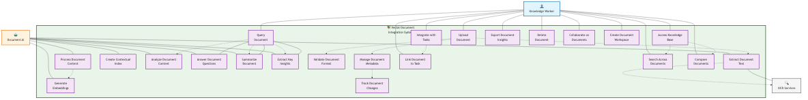

# UML Use Case: Document Integration & Knowledge Processing

This UML use case diagram represents how users interact with Vectal's document processing capabilities to create queryable knowledge bases from PDF documents with AI-powered analysis and contextual assistance.

## Actors
- **Primary Actor**: Knowledge Worker (Researchers, students, professionals, analysts)
- **Secondary Actor**: Document AI (Vectal's document processing AI)
- **Supporting Actor**: External OCR Services (Cloud-based text extraction services)

## System Boundary
**Vectal Document Integration System** - AI-powered document processing and knowledge management platform

```mermaid
graph TB
    %% Actors (outside system boundary)
    KnowledgeWorker["👤<br/>Knowledge Worker"]
    DocumentAI["🤖<br/>Document AI"]
    OCRServices["🔍<br/>OCR Services"]
    
    %% System boundary
    subgraph SystemBoundary["📚 Vectal Document Integration System"]
        %% Primary Use Cases
        UploadDocument["Upload<br/>Document"]
        QueryDocument["Query<br/>Document"]
        IntegrateWithTasks["Integrate with<br/>Tasks"]
        AccessKnowledgeBase["Access Knowledge<br/>Base"]
        
        %% Document Processing Use Cases
        ExtractDocumentText["Extract Document<br/>Text"]
        ProcessDocumentContent["Process Document<br/>Content"]
        GenerateEmbeddings["Generate<br/>Embeddings"]
        CreateContextualIndex["Create Contextual<br/>Index"]
        
        %% AI Analysis Use Cases
        AnalyzeDocumentContent["Analyze Document<br/>Content"]
        AnswerDocumentQuestions["Answer Document<br/>Questions"]
        SummarizeDocument["Summarize<br/>Document"]
        ExtractKeyInsights["Extract Key<br/>Insights"]
        
        %% Supporting Use Cases
        ValidateDocumentFormat["Validate Document<br/>Format"]
        ManageDocumentMetadata["Manage Document<br/>Metadata"]
        LinkDocumentToTask["Link Document<br/>to Task"]
        SearchAcrossDocuments["Search Across<br/>Documents"]
        ExportDocumentInsights["Export Document<br/>Insights"]
        DeleteDocument["Delete<br/>Document"]
        
        %% Advanced Use Cases
        CompareDocuments["Compare<br/>Documents"]
        TrackDocumentChanges["Track Document<br/>Changes"]
        CollaborateOnDocuments["Collaborate on<br/>Documents"]
        CreateDocumentWorkspace["Create Document<br/>Workspace"]
    end
    
    %% Primary Actor Associations
    KnowledgeWorker --- UploadDocument
    KnowledgeWorker --- QueryDocument
    KnowledgeWorker --- IntegrateWithTasks
    KnowledgeWorker --- AccessKnowledgeBase
    KnowledgeWorker --- LinkDocumentToTask
    KnowledgeWorker --- SearchAcrossDocuments
    KnowledgeWorker --- ExportDocumentInsights
    KnowledgeWorker --- DeleteDocument
    KnowledgeWorker --- CompareDocuments
    KnowledgeWorker --- CollaborateOnDocuments
    KnowledgeWorker --- CreateDocumentWorkspace
    
    %% Secondary Actor Associations (Document AI)
    DocumentAI --- ExtractDocumentText
    DocumentAI --- ProcessDocumentContent
    DocumentAI --- GenerateEmbeddings
    DocumentAI --- CreateContextualIndex
    DocumentAI --- AnalyzeDocumentContent
    DocumentAI --- AnswerDocumentQuestions
    DocumentAI --- SummarizeDocument
    DocumentAI --- ExtractKeyInsights
    
    %% Supporting Actor Associations
    OCRServices --- ExtractDocumentText
    
    %% Include Relationships
    UploadDocument -.-> ValidateDocumentFormat
    UploadDocument -.-> ExtractDocumentText
    UploadDocument -.-> ManageDocumentMetadata
    ProcessDocumentContent -.-> GenerateEmbeddings
    QueryDocument -.-> AnalyzeDocumentContent
    AccessKnowledgeBase -.-> SearchAcrossDocuments
    
    %% Extend Relationships
    ExtractDocumentText -.-> OCRServices
    QueryDocument -.-> SummarizeDocument
    QueryDocument -.-> ExtractKeyInsights
    IntegrateWithTasks -.-> LinkDocumentToTask
    AccessKnowledgeBase -.-> CompareDocuments
    ManageDocumentMetadata -.-> TrackDocumentChanges
    
    %% Generalization
    QueryDocument --- AnswerDocumentQuestions
    QueryDocument --- SummarizeDocument
    QueryDocument --- ExtractKeyInsights
    
    %% Styling
    classDef actor fill:#e1f5fe,stroke:#01579b,stroke-width:2px
    classDef usecase fill:#f3e5f5,stroke:#7b1fa2,stroke-width:2px
    classDef system fill:#e8f5e8,stroke:#2e7d32,stroke-width:3px
    classDef docai fill:#fff3e0,stroke:#ef6c00,stroke-width:2px
    classDef external fill:#f5f5f5,stroke:#616161,stroke-width:2px
    
    class KnowledgeWorker actor
    class DocumentAI docai
    class OCRServices external
    class UploadDocument,QueryDocument,IntegrateWithTasks,AccessKnowledgeBase,ExtractDocumentText,ProcessDocumentContent,GenerateEmbeddings,CreateContextualIndex,AnalyzeDocumentContent,AnswerDocumentQuestions,SummarizeDocument,ExtractKeyInsights,ValidateDocumentFormat,ManageDocumentMetadata,LinkDocumentToTask,SearchAcrossDocuments,ExportDocumentInsights,DeleteDocument,CompareDocuments,TrackDocumentChanges,CollaborateOnDocuments,CreateDocumentWorkspace usecase
    class SystemBoundary system
```

> **🖼️ Static Image**: 

## Use Case Specifications

### Primary Use Cases

#### 1. Upload Document
- **Actor**: Knowledge Worker
- **Goal**: Add PDF documents to the system for processing and analysis
- **Preconditions**: User has valid document to upload
- **Main Flow**:
  1. User selects PDF document file
  2. System validates document format and size
  3. System extracts text content (OCR if needed)
  4. System generates document metadata
  5. System processes content for indexing
  6. Document becomes available for querying

#### 2. Query Document
- **Actor**: Knowledge Worker
- **Goal**: Ask questions about document content and receive AI-powered answers
- **Preconditions**: Documents are uploaded and processed
- **Main Flow**:
  1. User submits question about document content
  2. System analyzes query intent and context
  3. Document AI searches relevant content sections
  4. AI generates contextual answer with citations
  5. System presents answer with source references

#### 3. Integrate with Tasks
- **Actor**: Knowledge Worker
- **Goal**: Connect document insights with task management workflows
- **Preconditions**: Documents and tasks exist in system
- **Main Flow**:
  1. User selects document and related task
  2. System analyzes document content for task relevance
  3. AI generates task-specific insights from document
  4. System enhances task context with document knowledge
  5. User receives enhanced task assistance

#### 4. Access Knowledge Base
- **Actor**: Knowledge Worker
- **Goal**: Search and explore the collection of processed documents
- **Preconditions**: Multiple documents are processed in system
- **Main Flow**:
  1. User accesses knowledge base interface
  2. System displays document collection and search options
  3. User performs searches across document collection
  4. System returns relevant documents and content sections
  5. User can navigate between related documents and insights

### Document Processing Use Cases

#### 5. Extract Document Text
- **Actor**: Document AI, OCR Services
- **Goal**: Convert PDF content into searchable text format
- **Trigger**: Document upload completion
- **Main Flow**:
  1. System identifies document type (scanned vs digital)
  2. For digital PDFs: Direct text extraction
  3. For scanned PDFs: OCR service processes images
  4. System cleans and normalizes extracted text
  5. Text content stored for further processing

#### 6. Process Document Content
- **Actor**: Document AI
- **Goal**: Prepare document content for AI analysis and search
- **Trigger**: Text extraction completion
- **Main Flow**:
  1. AI segments text into logical chunks
  2. System determines processing route (vector vs direct context)
  3. AI generates embeddings for large documents
  4. System creates searchable index
  5. Content prepared for contextual queries

#### 7. Generate Embeddings
- **Actor**: Document AI
- **Goal**: Create vector representations for semantic search
- **Trigger**: Large document processing
- **Main Flow**:
  1. AI splits document into semantic chunks
  2. System generates vector embeddings for each chunk
  3. Embeddings stored in vector database
  4. Semantic search index created
  5. Document ready for similarity-based queries

### AI Analysis Use Cases

#### 8. Analyze Document Content
- **Actor**: Document AI
- **Goal**: Understand document meaning and extract insights
- **Trigger**: User queries or document processing
- **Main Flow**:
  1. AI analyzes document structure and content
  2. System identifies key topics and themes
  3. AI extracts important entities and relationships
  4. System creates content summary and metadata
  5. Analysis results available for user queries

#### 9. Answer Document Questions
- **Actor**: Document AI
- **Goal**: Provide specific answers to user questions about documents
- **Trigger**: User submits document query
- **Main Flow**:
  1. AI analyzes question intent and context
  2. System retrieves relevant document sections
  3. AI generates contextual answer using document content
  4. System provides citations and source references
  5. Answer presented with supporting evidence

#### 10. Summarize Document
- **Actor**: Document AI
- **Goal**: Create concise summaries of document content
- **Trigger**: User requests summary or automatic processing
- **Main Flow**:
  1. AI analyzes entire document structure
  2. System identifies key points and main themes
  3. AI generates executive summary
  4. System creates structured summary with sections
  5. Summary available for quick document understanding

## Relationship Types

### Include Relationships
- **Upload Document includes Validate Document Format**: Every upload requires format validation
- **Upload Document includes Extract Document Text**: Text extraction is mandatory for all uploads
- **Process Document Content includes Generate Embeddings**: Large documents require embedding generation
- **Query Document includes Analyze Document Content**: All queries require content analysis

### Extend Relationships
- **Extract Document Text extends to OCR Services**: Only scanned documents require OCR processing
- **Query Document extends to Summarize Document**: Summaries are optional enhancement to basic queries
- **Integrate with Tasks extends to Link Document to Task**: Task linking is optional integration
- **Access Knowledge Base extends to Compare Documents**: Document comparison is advanced feature

### Generalization Relationships
- **Query Document** generalizes to specific query types (Answer Questions, Summarize, Extract Insights)

## Business Value

### Knowledge Worker Benefits
- **Instant Document Intelligence**: Transform static PDFs into queryable knowledge
- **Contextual Assistance**: AI provides relevant help based on document content
- **Unified Knowledge Base**: Centralized access to all document insights
- **Task Integration**: Document knowledge enhances productivity workflows

### System Capabilities
- **Hybrid Processing**: Combines vector search with large-context models
- **Intelligent Extraction**: Handles both digital and scanned documents
- **Semantic Understanding**: AI comprehends document meaning, not just keywords
- **Scalable Architecture**: Processes documents from simple to complex formats

### Competitive Advantages
- **Large Context Handling**: ~100k-200k token context windows
- **Multi-Modal Processing**: Text extraction, OCR, and semantic analysis
- **Task Integration**: Documents enhance productivity rather than existing in isolation
- **Privacy-First**: User documents remain private and secure

## Technical Implementation Notes

### Processing Architecture
- **Hybrid Approach**: Vector embeddings for large docs, direct context for medium docs
- **Claude Integration**: Leverages Claude 3.7 Sonnet and Opus for large context processing
- **Vector Databases**: Pinecone, Weaviate, or ChromaDB for semantic search
- **OCR Integration**: Tesseract or cloud-based OCR for scanned documents

### Integration Points
- **Task Management**: Document context enhances task assistance
- **Chat Interface**: Seamless document Q&A within conversations
- **Web Research**: Documents complement external information gathering
- **Analytics**: Track document usage and insights generation

---

*This UML use case diagram focuses on functional document processing capabilities and user goals, showing how documents become intelligent, queryable knowledge assets rather than static files.*