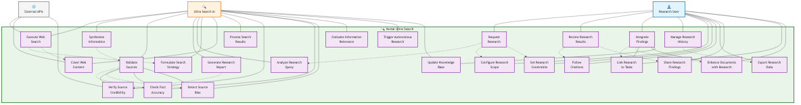

# UML Use Case: Web Research & External Integration (Ultra Search)

This UML use case diagram represents how users interact with Vectal's AI-powered web research capabilities to gather, synthesize, and integrate external information with proper citations and quality validation.

## Actors
- **Primary Actor**: Research User (Researchers, content creators, analysts, decision makers)
- **Secondary Actor**: Ultra Search AI (Vectal's web research AI agent)
- **Supporting Actor**: External APIs (Perplexity, search engines, knowledge bases)

## System Boundary
**Vectal Ultra Search System** - AI-powered web research and information synthesis platform

> **🖼️ Static Image**: 

## Use Case Specifications

### Primary Use Cases

#### 1. Request Research
- **Actor**: Research User
- **Goal**: Initiate AI-powered web research on a specific topic or question
- **Preconditions**: User has Ultra Search access
- **Main Flow**:
  1. User submits research query or topic
  2. System analyzes research intent and scope
  3. User configures research parameters (depth, sources, constraints)
  4. Ultra Search AI formulates comprehensive search strategy
  5. Research execution begins with real-time status updates

#### 2. Review Research Results
- **Actor**: Research User
- **Goal**: Examine and evaluate AI-generated research findings
- **Preconditions**: Research has been completed by Ultra Search AI
- **Main Flow**:
  1. User accesses research results dashboard
  2. System presents synthesized findings with executive summary
  3. User reviews detailed analysis and supporting data
  4. User follows citations to verify source materials
  5. User evaluates research quality and completeness

#### 3. Integrate Findings
- **Actor**: Research User
- **Goal**: Incorporate research insights into tasks, documents, or knowledge base
- **Preconditions**: Research results are available and reviewed
- **Main Flow**:
  1. User selects integration target (task, document, knowledge base)
  2. System identifies relevant research insights for integration
  3. User customizes how findings should be incorporated
  4. System integrates research data with existing content
  5. Enhanced content becomes available with research context

#### 4. Manage Research History
- **Actor**: Research User
- **Goal**: Access, organize, and maintain historical research activities
- **Preconditions**: User has conducted previous research
- **Main Flow**:
  1. User accesses research history interface
  2. System displays chronological list of research activities
  3. User can search, filter, and organize historical research
  4. User can re-run previous research with updated parameters
  5. Research archive maintained for future reference

### Research Execution Use Cases

#### 5. Execute Web Search
- **Actor**: Ultra Search AI, External APIs
- **Goal**: Perform comprehensive web search across multiple sources
- **Trigger**: Research request initiation
- **Main Flow**:
  1. AI formulates optimal search queries
  2. System distributes searches across multiple APIs and engines
  3. External APIs return search results and content
  4. AI processes and filters results for relevance
  5. Comprehensive search results compiled for synthesis

#### 6. Synthesize Information
- **Actor**: Ultra Search AI
- **Goal**: Combine information from multiple sources into coherent insights
- **Trigger**: Web search completion
- **Main Flow**:
  1. AI analyzes all gathered information for themes and patterns
  2. System cross-references information across sources
  3. AI identifies key insights and supporting evidence
  4. System validates information consistency and accuracy
  5. Synthesized insights compiled into research report

#### 7. Validate Sources
- **Actor**: Ultra Search AI
- **Goal**: Assess credibility and reliability of information sources
- **Trigger**: Information synthesis process
- **Main Flow**:
  1. AI evaluates source authority and credibility
  2. System checks for potential bias and conflicts of interest
  3. AI cross-validates facts across multiple sources
  4. System assigns reliability scores to sources
  5. Quality assessment integrated into research findings

#### 8. Generate Research Report
- **Actor**: Ultra Search AI
- **Goal**: Create comprehensive, structured research report with citations
- **Trigger**: Information synthesis and validation completion
- **Main Flow**:
  1. AI structures findings into logical report format
  2. System generates executive summary and key findings
  3. AI creates detailed analysis with supporting data
  4. System adds proper citations and source references
  5. Complete research report ready for user review

### AI Agent Use Cases

#### 9. Analyze Research Query
- **Actor**: Ultra Search AI
- **Goal**: Understand research intent and determine optimal approach
- **Trigger**: User submits research request
- **Main Flow**:
  1. AI parses research query for key concepts and intent
  2. System identifies research type (exploratory, specific, comparative)
  3. AI determines scope and depth requirements
  4. System selects appropriate research methodology
  5. Research strategy formulated based on analysis

#### 10. Formulate Search Strategy
- **Actor**: Ultra Search AI
- **Goal**: Create optimal search approach across multiple sources
- **Trigger**: Research query analysis completion
- **Main Flow**:
  1. AI identifies most relevant search engines and APIs
  2. System generates diverse search query variations
  3. AI selects specialized sources for topic domain
  4. System plans search execution sequence
  5. Comprehensive search strategy ready for execution

## Relationship Types

### Include Relationships
- **Request Research includes Analyze Research Query**: Every research request requires query analysis
- **Request Research includes Configure Research Scope**: Research scope configuration is mandatory
- **Execute Web Search includes Formulate Search Strategy**: Search execution requires strategy formulation
- **Synthesize Information includes Validate Sources**: Information synthesis must include source validation

### Extend Relationships
- **Request Research extends to Set Research Constraints**: Users can optionally set specific constraints
- **Execute Web Search extends to Crawl Web Content**: Some searches require deep content crawling
- **Validate Sources extends to Check Fact Accuracy**: Advanced validation includes fact checking
- **Integrate Findings extends to Link to Tasks**: Research can be optionally linked to specific tasks

### Generalization Relationships
- **Integrate Findings** generalizes to specific integration types (Tasks, Documents, Knowledge Base)
- **Validate Sources** generalizes to specific validation methods (Credibility, Accuracy, Bias Detection)

## Business Value

### Research User Benefits
- **Comprehensive Intelligence**: AI gathers and synthesizes information from multiple sources
- **Quality Assurance**: Automated source validation and fact checking
- **Time Efficiency**: Autonomous research reduces manual information gathering
- **Actionable Insights**: Research findings directly integrate with productivity workflows

### System Capabilities
- **Multi-Source Research**: Searches across search engines, academic sources, news APIs
- **Intelligent Synthesis**: AI combines information into coherent, actionable insights
- **Quality Control**: Automated credibility assessment and bias detection
- **Citation Management**: Proper source attribution and reference tracking

### Competitive Advantages
- **Beyond Simple Search**: Autonomous research agent vs basic search tools
- **Information Synthesis**: AI understanding and insight generation
- **Quality Validation**: Automated fact-checking and source verification
- **Workflow Integration**: Research enhances tasks and documents rather than existing in isolation

## Usage Tiers & Quotas

### Free Tier
- Limited Ultra Search queries per day
- Basic search sources and APIs
- Standard processing speed
- Essential citation and formatting

### Pro Tier
- 10× more Ultra Search queries than free tier
- Access to premium search APIs and academic sources
- Priority processing and faster results
- Advanced analytics and export features

## Integration Points

### Internal Integrations
- **Infinite Thinking**: Autonomous agents can trigger research automatically
- **Task Management**: Research findings enhance task context and planning
- **Document Processing**: Research complements uploaded document analysis
- **Chat Interface**: Seamless research requests within conversations

### External Integrations
- **Perplexity API**: Primary search and synthesis engine
- **Academic Databases**: Research papers and scholarly articles
- **News APIs**: Real-time information and current events
- **Government Data**: Official statistics and regulatory information

## Research Capabilities

### Information Types
- **Current Events**: Real-time news and trending topics
- **Market Research**: Business trends and competitive analysis
- **Academic Research**: Scholarly articles and peer-reviewed studies
- **Technical Documentation**: Specifications, tutorials, and how-to guides
- **Statistical Data**: Government data, surveys, and analytical reports

### Output Formats
- **Executive Summary**: High-level overview for decision makers
- **Detailed Analysis**: Comprehensive research report with supporting data
- **Key Insights**: Actionable findings and recommendations
- **Comparative Analysis**: Side-by-side evaluation of alternatives
- **Source Citations**: Complete references and attribution

---

*This UML use case diagram emphasizes the intelligent research capabilities and quality assurance aspects of Vectal's Ultra Search system, showing how AI agents transform web research from manual information gathering into automated intelligence synthesis.*