# UML Use Case: System Architecture & Multi-Model Orchestration

This UML use case diagram represents the system administration and technical management aspects of Vectal's infrastructure, focusing on how different stakeholders interact with the platform's technical architecture and AI model orchestration.

## Actors
- **Primary Actor**: System Administrator (DevOps engineers, system administrators)
- **Secondary Actor**: AI Model Router (Vectal's AI orchestration system)
- **Supporting Actor**: External AI Providers (OpenAI, Anthropic, DeepSeek APIs)
- **Monitoring Actor**: Analytics System (Performance and usage monitoring)

## System Boundary
**Vectal Platform Infrastructure** - Multi-model AI orchestration and scalable system architecture

```mermaid
graph TB
    %% Actors (outside system boundary)
    SystemAdmin["👨‍💻<br/>System Administrator"]
    AIModelRouter["🧠<br/>AI Model Router"]
    ExternalProviders["🌐<br/>External AI Providers"]
    AnalyticsSystem["📊<br/>Analytics System"]
    
    %% System boundary
    subgraph SystemBoundary["⚙️ Vectal Platform Infrastructure"]
        %% Primary Administrative Use Cases
        ManageInfrastructure["Manage<br/>Infrastructure"]
        MonitorSystemHealth["Monitor System<br/>Health"]
        ConfigureScaling["Configure<br/>Scaling"]
        ManageSecurityPolicies["Manage Security<br/>Policies"]
        
        %% AI Model Management Use Cases
        ConfigureModelRouting["Configure Model<br/>Routing"]
        ManageModelProviders["Manage Model<br/>Providers"]
        MonitorModelPerformance["Monitor Model<br/>Performance"]
        OptimizeModelSelection["Optimize Model<br/>Selection"]
        
        %% Infrastructure Management Use Cases
        DeployServices["Deploy<br/>Services"]
        ScaleResources["Scale<br/>Resources"]
        ManageLoadBalancing["Manage Load<br/>Balancing"]
        ConfigureNetworking["Configure<br/>Networking"]
        
        %% Security & Compliance Use Cases
        ImplementSecurityMeasures["Implement Security<br/>Measures"]
        ManageUserAccess["Manage User<br/>Access"]
        EnsureDataPrivacy["Ensure Data<br/>Privacy"]
        HandleComplianceReporting["Handle Compliance<br/>Reporting"]
        
        %% Monitoring & Analytics Use Cases
        TrackSystemMetrics["Track System<br/>Metrics"]
        AnalyzePerformanceData["Analyze Performance<br/>Data"]
        GenerateSystemReports["Generate System<br/>Reports"]
        AlertOnSystemIssues["Alert on System<br/>Issues"]
        
        %% Data Management Use Cases
        ManageDatabases["Manage<br/>Databases"]
        BackupSystemData["Backup System<br/>Data"]
        ManageDataRetention["Manage Data<br/>Retention"]
        OptimizeDataStorage["Optimize Data<br/>Storage"]
        
        %% AI Router Autonomous Use Cases
        RouteAIRequests["Route AI<br/>Requests"]
        SelectOptimalModel["Select Optimal<br/>Model"]
        BalanceModelLoad["Balance Model<br/>Load"]
        HandleModelFailures["Handle Model<br/>Failures"]
        CacheModelResponses["Cache Model<br/>Responses"]
        
        %% External Integration Use Cases
        IntegrateExternalAPIs["Integrate External<br/>APIs"]
        ManageAPICredentials["Manage API<br/>Credentials"]
        MonitorExternalServices["Monitor External<br/>Services"]
        HandleAPIRateLimits["Handle API<br/>Rate Limits"]
    end
    
    %% Primary Actor Associations
    SystemAdmin --- ManageInfrastructure
    SystemAdmin --- MonitorSystemHealth
    SystemAdmin --- ConfigureScaling
    SystemAdmin --- ManageSecurityPolicies
    SystemAdmin --- ConfigureModelRouting
    SystemAdmin --- ManageModelProviders
    SystemAdmin --- DeployServices
    SystemAdmin --- ScaleResources
    SystemAdmin --- ManageLoadBalancing
    SystemAdmin --- ConfigureNetworking
    SystemAdmin --- ImplementSecurityMeasures
    SystemAdmin --- ManageUserAccess
    SystemAdmin --- EnsureDataPrivacy
    SystemAdmin --- HandleComplianceReporting
    SystemAdmin --- ManageDatabases
    SystemAdmin --- BackupSystemData
    SystemAdmin --- ManageDataRetention
    SystemAdmin --- OptimizeDataStorage
    SystemAdmin --- IntegrateExternalAPIs
    SystemAdmin --- ManageAPICredentials
    
    %% Secondary Actor Associations (AI Model Router)
    AIModelRouter --- RouteAIRequests
    AIModelRouter --- SelectOptimalModel
    AIModelRouter --- BalanceModelLoad
    AIModelRouter --- HandleModelFailures
    AIModelRouter --- CacheModelResponses
    AIModelRouter --- OptimizeModelSelection
    
    %% Supporting Actor Associations
    ExternalProviders --- RouteAIRequests
    ExternalProviders --- MonitorExternalServices
    ExternalProviders --- HandleAPIRateLimits
    
    %% Monitoring Actor Associations
    AnalyticsSystem --- TrackSystemMetrics
    AnalyticsSystem --- AnalyzePerformanceData
    AnalyticsSystem --- GenerateSystemReports
    AnalyticsSystem --- AlertOnSystemIssues
    AnalyticsSystem --- MonitorModelPerformance
    AnalyticsSystem --- MonitorExternalServices
    
    %% Include Relationships
    ManageInfrastructure -.-> MonitorSystemHealth
    ManageInfrastructure -.-> ConfigureScaling
    ConfigureModelRouting -.-> ManageModelProviders
    RouteAIRequests -.-> SelectOptimalModel
    ImplementSecurityMeasures -.-> ManageUserAccess
    ManageDatabases -.-> BackupSystemData
    
    %% Extend Relationships
    MonitorSystemHealth -.-> AlertOnSystemIssues
    ConfigureScaling -.-> ScaleResources
    SelectOptimalModel -.-> OptimizeModelSelection
    RouteAIRequests -.-> CacheModelResponses
    ManageInfrastructure -.-> OptimizeDataStorage
    IntegrateExternalAPIs -.-> HandleAPIRateLimits
    
    %% Generalization
    ManageInfrastructure --- DeployServices
    ManageInfrastructure --- ScaleResources
    ManageInfrastructure --- ManageLoadBalancing
    
    ImplementSecurityMeasures --- ManageUserAccess
    ImplementSecurityMeasures --- EnsureDataPrivacy
    ImplementSecurityMeasures --- HandleComplianceReporting
    
    %% Styling
    classDef actor fill:#e1f5fe,stroke:#01579b,stroke-width:2px
    classDef usecase fill:#f3e5f5,stroke:#7b1fa2,stroke-width:2px
    classDef system fill:#e8f5e8,stroke:#2e7d32,stroke-width:3px
    classDef airouter fill:#fff3e0,stroke:#ef6c00,stroke-width:2px
    classDef external fill:#f5f5f5,stroke:#616161,stroke-width:2px
    classDef monitoring fill:#e8eaf6,stroke:#3f51b5,stroke-width:2px
    
    class SystemAdmin actor
    class AIModelRouter airouter
    class ExternalProviders external
    class AnalyticsSystem monitoring
    class ManageInfrastructure,MonitorSystemHealth,ConfigureScaling,ManageSecurityPolicies,ConfigureModelRouting,ManageModelProviders,MonitorModelPerformance,OptimizeModelSelection,DeployServices,ScaleResources,ManageLoadBalancing,ConfigureNetworking,ImplementSecurityMeasures,ManageUserAccess,EnsureDataPrivacy,HandleComplianceReporting,TrackSystemMetrics,AnalyzePerformanceData,GenerateSystemReports,AlertOnSystemIssues,ManageDatabases,BackupSystemData,ManageDataRetention,OptimizeDataStorage,RouteAIRequests,SelectOptimalModel,BalanceModelLoad,HandleModelFailures,CacheModelResponses,IntegrateExternalAPIs,ManageAPICredentials,MonitorExternalServices,HandleAPIRateLimits usecase
    class SystemBoundary system
```

> **🖼️ Static Image**: 

## Use Case Specifications

### Primary Administrative Use Cases

#### 1. Manage Infrastructure
- **Actor**: System Administrator
- **Goal**: Oversee and maintain the complete Vectal platform infrastructure
- **Preconditions**: Administrator has system access and permissions
- **Main Flow**:
  1. Administrator accesses infrastructure management console
  2. System displays current infrastructure status and metrics
  3. Administrator configures services, scaling, and networking
  4. System applies configuration changes across infrastructure
  5. Infrastructure operates according to new configuration

#### 2. Monitor System Health
- **Actor**: System Administrator
- **Goal**: Continuously track system performance and identify issues
- **Preconditions**: Monitoring systems are deployed and configured
- **Main Flow**:
  1. Administrator accesses system health dashboard
  2. Analytics system provides real-time performance metrics
  3. Administrator reviews system status across all components
  4. System alerts administrator to any performance issues
  5. Administrator takes corrective actions as needed

#### 3. Configure Scaling
- **Actor**: System Administrator
- **Goal**: Set up automatic and manual scaling policies for system components
- **Preconditions**: Infrastructure supports auto-scaling capabilities
- **Main Flow**:
  1. Administrator defines scaling policies and thresholds
  2. System configures auto-scaling rules for different components
  3. Administrator sets resource limits and scaling boundaries
  4. System monitors load and applies scaling policies automatically
  5. Scaling actions logged and reported to administrator

#### 4. Manage Security Policies
- **Actor**: System Administrator
- **Goal**: Implement and maintain comprehensive security measures
- **Preconditions**: Security framework is established
- **Main Flow**:
  1. Administrator defines security policies and access controls
  2. System implements encryption, authentication, and authorization
  3. Administrator configures compliance and audit requirements
  4. System enforces security policies across all components
  5. Security status monitored and reported continuously

### AI Model Management Use Cases

#### 5. Configure Model Routing
- **Actor**: System Administrator
- **Goal**: Set up intelligent routing between different AI models
- **Preconditions**: Multiple AI model providers are integrated
- **Main Flow**:
  1. Administrator accesses AI model routing configuration
  2. System displays available models and their capabilities
  3. Administrator defines routing rules based on request types
  4. AI Model Router applies routing configuration
  5. Request routing operates according to defined rules

#### 6. Manage Model Providers
- **Actor**: System Administrator
- **Goal**: Configure and maintain integrations with external AI providers
- **Preconditions**: API credentials and provider access available
- **Main Flow**:
  1. Administrator manages API credentials for AI providers
  2. System tests connectivity and functionality with providers
  3. Administrator configures model preferences and fallbacks
  4. System maintains provider health and performance monitoring
  5. Provider management updates applied across platform

#### 7. Monitor Model Performance
- **Actor**: Analytics System
- **Goal**: Track AI model usage, performance, and quality metrics
- **Trigger**: Continuous monitoring of AI model operations
- **Main Flow**:
  1. Analytics system collects model usage and performance data
  2. System analyzes response times, success rates, and quality scores
  3. Performance metrics compiled into reports and dashboards
  4. System alerts on performance degradation or issues
  5. Performance data used for optimization recommendations

### AI Router Autonomous Use Cases

#### 8. Route AI Requests
- **Actor**: AI Model Router, External Providers
- **Goal**: Intelligently distribute AI requests to optimal models
- **Trigger**: User requests requiring AI processing
- **Main Flow**:
  1. AI Router receives request and analyzes requirements
  2. Router selects optimal model based on request characteristics
  3. Router sends request to selected external AI provider
  4. External provider processes request and returns response
  5. Router delivers response to requesting system component

#### 9. Select Optimal Model
- **Actor**: AI Model Router
- **Goal**: Choose the best AI model for each specific request type
- **Trigger**: AI request routing decision point
- **Main Flow**:
  1. Router analyzes request complexity, type, and context
  2. Router evaluates available models and their capabilities
  3. Router considers current model load and performance
  4. Router selects model with best fit for request requirements
  5. Selection criteria updated based on performance feedback

#### 10. Handle Model Failures
- **Actor**: AI Model Router
- **Goal**: Manage AI provider outages and request failures gracefully
- **Trigger**: AI provider failure or service degradation
- **Main Flow**:
  1. Router detects model or provider failure
  2. Router automatically switches to backup provider/model
  3. Router retries failed requests with fallback options
  4. System logs failure details for administrator review
  5. Router restores primary provider when service recovers

## Relationship Types

### Include Relationships
- **Manage Infrastructure includes Monitor System Health**: Infrastructure management requires health monitoring
- **Manage Infrastructure includes Configure Scaling**: Infrastructure management includes scaling configuration
- **Configure Model Routing includes Manage Model Providers**: Model routing requires provider management
- **Route AI Requests includes Select Optimal Model**: Request routing must include model selection

### Extend Relationships
- **Monitor System Health extends to Alert on System Issues**: Health monitoring can trigger alerts
- **Configure Scaling extends to Scale Resources**: Scaling configuration can trigger resource scaling
- **Route AI Requests extends to Cache Model Responses**: Request routing can include response caching
- **Manage Infrastructure extends to Optimize Data Storage**: Infrastructure management can include optimization

### Generalization Relationships
- **Manage Infrastructure** generalizes to specific infrastructure tasks (Deploy, Scale, Load Balance)
- **Implement Security Measures** generalizes to specific security functions (Access, Privacy, Compliance)

## Business Value

### System Administrator Benefits
- **Centralized Management**: Single interface for managing complex multi-model infrastructure
- **Intelligent Automation**: AI-powered decision making for model selection and scaling
- **Comprehensive Monitoring**: Real-time visibility into system performance and health
- **Security & Compliance**: Built-in security measures and compliance reporting

### Technical Capabilities
- **Multi-Model Orchestration**: Seamless integration of multiple AI providers
- **Auto-Scaling**: Dynamic resource allocation based on demand
- **Fault Tolerance**: Automatic failover and recovery mechanisms
- **Performance Optimization**: Continuous optimization of model selection and resource usage

### Operational Advantages
- **High Availability**: 99.9% uptime through redundancy and failover
- **Cost Optimization**: Efficient resource utilization and dynamic scaling
- **Security-First**: Comprehensive security measures and privacy controls
- **Monitoring & Observability**: Complete visibility into system operations

## Technical Architecture Components

### Infrastructure Layer
- **Container Orchestration**: Kubernetes-based service deployment
- **Load Balancing**: Intelligent traffic distribution
- **Auto-Scaling**: Dynamic resource allocation
- **Networking**: Secure inter-service communication

### AI Model Integration
- **Model Router**: Intelligent request routing
- **Provider Management**: Multiple AI provider integration
- **Fallback Mechanisms**: Automatic failure handling
- **Performance Monitoring**: Continuous model evaluation

### Data & Security
- **Database Management**: PostgreSQL clusters with read replicas
- **Data Encryption**: AES-256 at rest, TLS 1.3 in transit
- **Access Control**: Role-based access control (RBAC)
- **Compliance**: GDPR and privacy regulation compliance

### Monitoring & Analytics
- **Performance Metrics**: Response times, throughput, error rates
- **Resource Monitoring**: CPU, memory, network, storage utilization
- **Business Metrics**: User engagement, feature usage, revenue impact
- **Alerting**: Proactive issue detection and notification

## Integration Points

### External AI Providers
- **OpenAI**: GPT-4.5 and other OpenAI models
- **Anthropic**: Claude 3.7 Sonnet, Claude Opus, Claude Instant
- **DeepSeek**: Experimental models for advanced capabilities
- **Provider Management**: Unified interface for all providers

### Cloud Infrastructure
- **Computing**: Auto-scaling compute resources
- **Storage**: S3-compatible object storage
- **Networking**: Global CDN and edge computing
- **Security**: Cloud-native security services

---

*This UML use case diagram focuses on the technical and administrative aspects of Vectal's platform, showing how system administrators and automated systems manage the complex multi-model AI infrastructure that powers all user-facing features.*